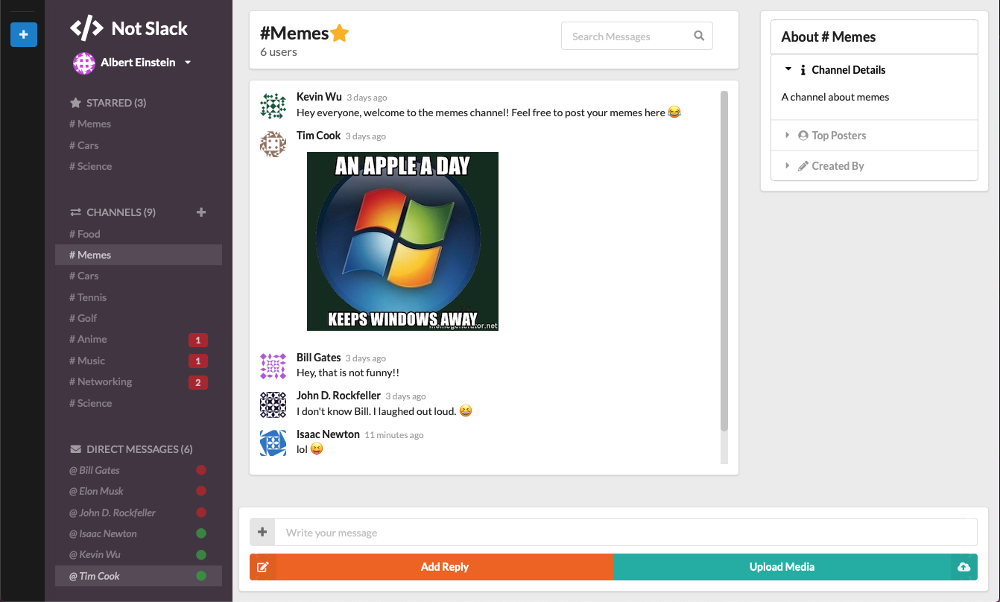
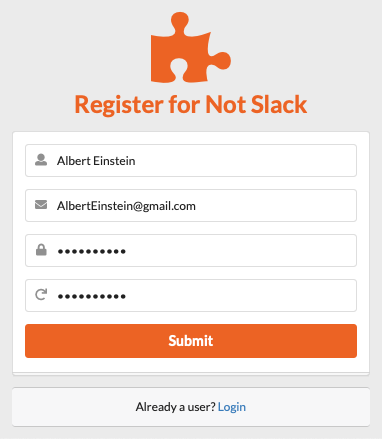
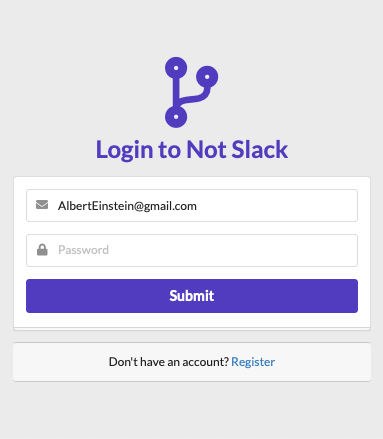
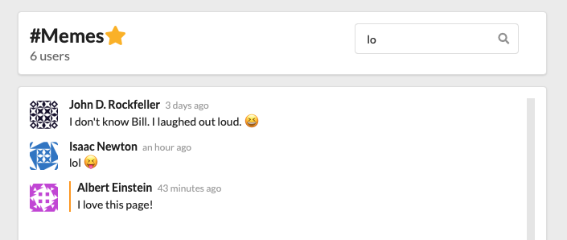
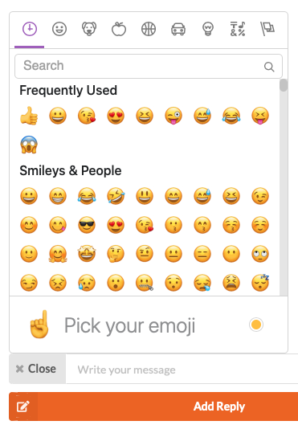
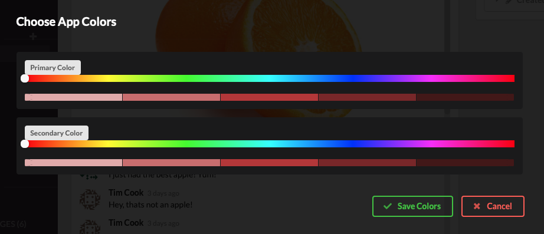

<h1 align="center">Project Not Slack</h1>
<h4 align="center">A Full-Stack real-time chat application created with React, Redux, and Firebase.</h4>
<h3 align="center">Live Link:</h3>
<h4 align="center">https://react-slack-clone-16b19.web.app</h4>

<h3 align="center">Technologies Used</h3>

  • React • Redux • Firebase • Html/CSS  • JavaScript ES6/7  • Semantic UI •  

<h3 align="center">Features</h3>

• securely register/login • create channels • favorite/unfavorite channels • send private/group messages • upload/view image messages • add emojis to messages • receive chat notifications • search for messages • crop and upload user avatars • see when other users are typing •

<h1></h1>
<h3 align="center">Main Page</h3>

  

<h3 align="center">Register and Login</h3>

  
  

<h3 align="center">Filter Messages</h3>

  

<h3 align="center">Express Yourself</h3>

  

<h3 align="center">Customize</h3>

  

